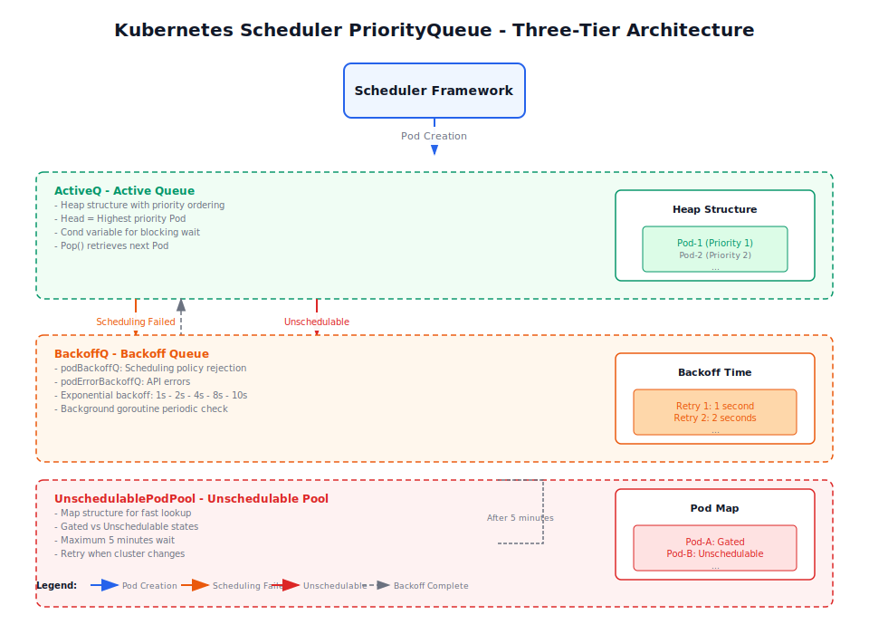
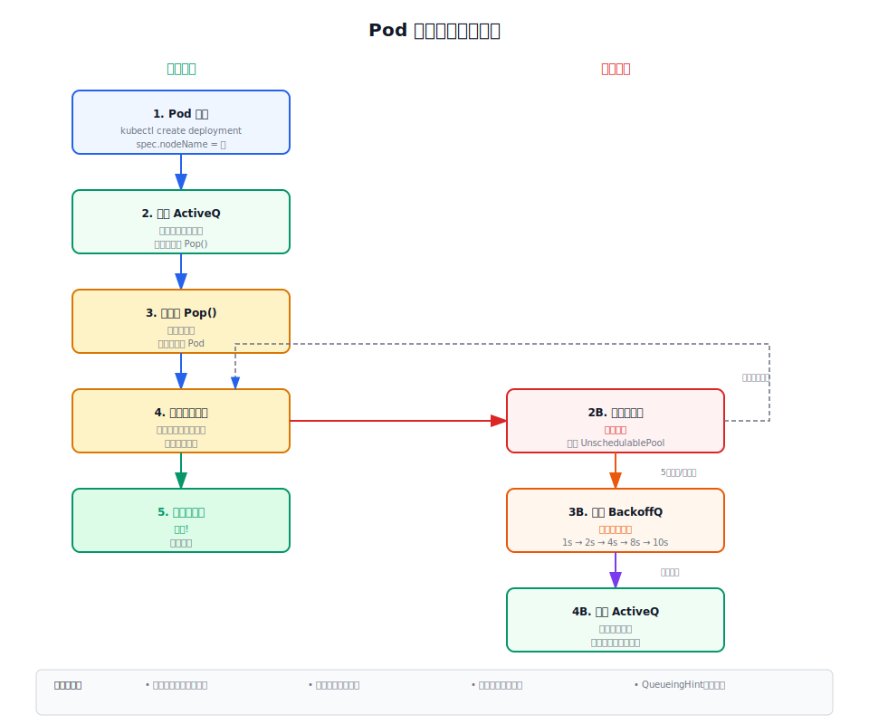
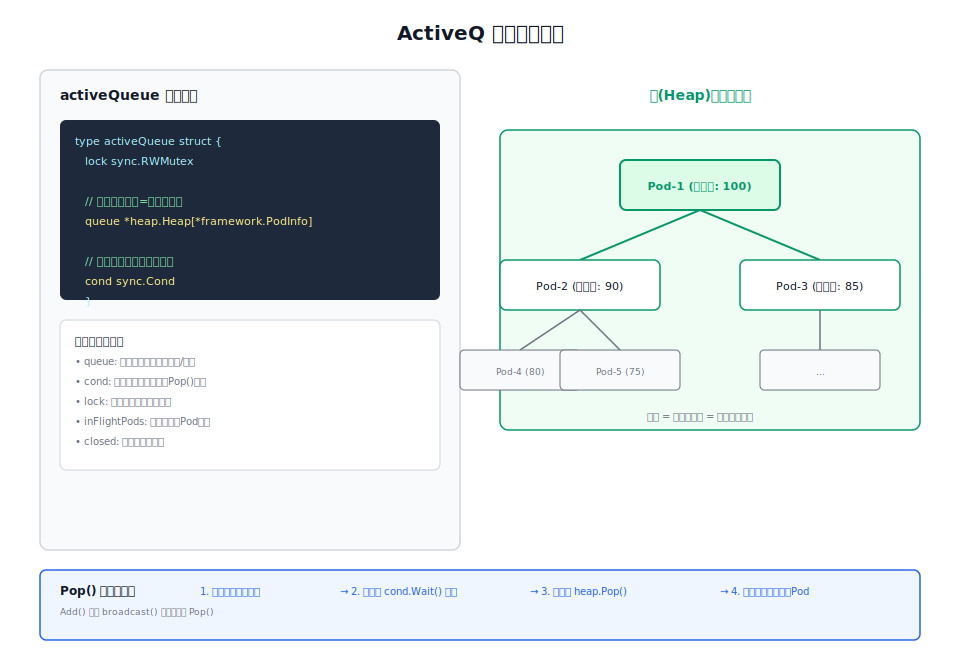
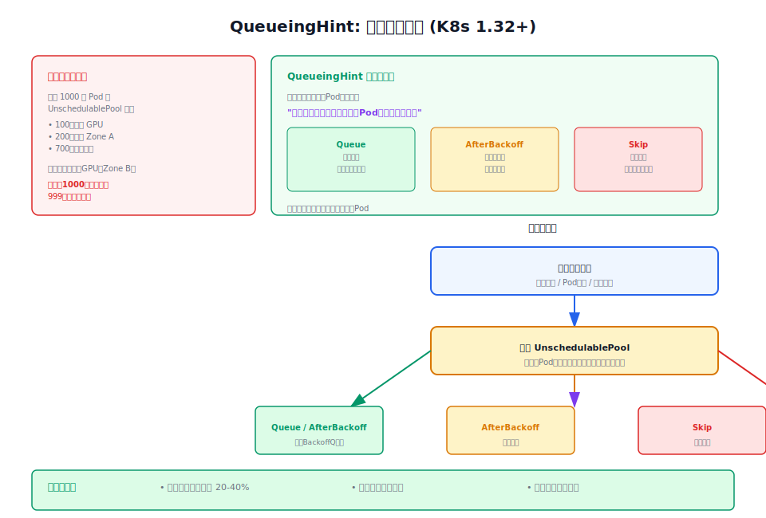

# 第2章：调度队列机制深度解析

假设你是一个 Kubernetes 集群管理员，早上来上班后发生了这样的场景：

> 100 个开发人员同时通过 CI/CD 提交了部署请求，一下子创建了 1000 个 Pod。但集群只有 10 个可用节点。

问题来了：
- 调度器怎么处理这 1000 个 Pod？
- 高优先级业务的 Pod 会不会被普通业务的 Pod 抢走资源？
- 如果节点资源用完了，剩下的 Pod 会怎么办？
- 等一会儿有节点空了，怎么把之前卡住的 Pod 重新调度？

调度队列就是专门来解决这些问题的。本章我们从实际场景出发，一步步理解调度队列的设计。

## 2.1 为什么需要调度队列

### 2.1.1 从一个简单的例子开始

让我们从最简单的场景开始理解调度队列的必要性：

**场景1：没有队列会怎么样？**
```
1000个Pod同时创建 → 都要马上调度
    ↓
调度器对每个Pod都要遍历所有节点检查资源
    ↓
1000 Pod × 10 节点 = 10000 次调度检查
    ↓
调度器CPU 100%，集群卡死
```

**场景2：有队列的情况**
```
1000个Pod同时创建 → 先按优先级排队
    ↓
高优先级Pod先被调度，一个一个来
    ↓
每次只调度一个Pod，调度器CPU正常
    ↓
调度失败的Pod在旁边等，等有变化再试
```

### 2.1.2 调度队列要解决的问题

调度队列本质上要解决三个问题：

| 问题 | 解决方案 |
|------|----------|
| **优先级问题**：有些 Pod 更重要，需要先调度 | PriorityQueue 的堆结构按优先级排序 |
| **重复调度问题**：资源不足的 Pod 不要一直重试 | UnschedulablePodPool + 退避机制 |
| **高效重试问题**：集群变化时，只把可能变得可调度的 Pod 重新尝试 | QueueingHint 机制 |

## 2.2 调度队列架构总览：从三层设计说起



Kubernetes 调度队列是一个三层设计：

1. **ActiveQ（活跃队列）**：前台窗口，Pod 在这里等着被调度
2. **BackoffQ（退避队列）**：等候区，调度失败的 Pod 在这里等一会儿再试
3. **UnschedulablePodPool（不可调度池）**：隔离区，暂时没办法调度的 Pod 放这里

### 2.2.1 用咖啡厅类比理解三层队列

想象你去一家网红咖啡厅：

| 队列 | 咖啡厅类比 | 调度器中的场景 |
|------|-----------|---------------|
| **ActiveQ** | 排队点单队伍 | 正常等着调度的 Pod |
| **BackoffQ** | 等座位叫号 | 之前点过但没座位，等5分钟再来问 |
| **UnschedulablePodPool** | 暂时没位置，留个联系方式 | 座位全满了，等有人离开再打电话通知 |

## 2.3 先看 Pod 在队列间的完整旅程

在深入代码之前，让我们看一个 Pod 从创建到成功调度（或失败）的完整生命周期，理解它在不同队列间是怎么移动的。



### 2.3.1 Pod 的一次完整旅程

让我们跟着一个叫 "my-app-1" 的 Pod 走一遍：

**步骤1：刚创建，进入 ActiveQ**
```
用户执行：kubectl create deployment my-app --image=nginx
    ↓
Pod "my-app-1" 创建成功，spec.nodeName 为空
    ↓
进入 PriorityQueue 的 ActiveQ（按优先级排好队）
```

**步骤2：被调度器取出来尝试调度**
```
调度器从 ActiveQ Pop 出 "my-app-1"
    ↓
遍历所有节点，检查资源、亲和性等
    ↓
情况A：找到节点 ✅ → 绑定，完成
情况B：没找到节点 ❌ → 进入 UnschedulablePodPool
```

**情况B 的后续：**
```
"my-app-1" 在 UnschedulablePodPool 里待着
    ↓
5分钟后（podMaxInUnschedulablePodsDuration）
或有节点加入 / 有 Pod 删除
    ↓
移到 BackoffQ
    ↓
退避时间到（比如1秒后）
    ↓
再移回 ActiveQ 重试
```

### 2.3.2 两个关键问题

现在你可能会问：
1. **为什么不直接在 ActiveQ 里重试，而是要先去 UnschedulablePodPool？**
   - 因为每次调度都很消耗资源（要遍历所有节点），不要在明显不可调度的 Pod 上浪费时间

2. **为什么从 UnschedulablePodPool 出来还要去 BackoffQ 等一会儿？**
   - 为了避免刚失败马上又试，又失败又试...造成死循环

好，理解了这个流程，我们再看源码实现就有意义了。

## 2.4 PriorityQueue：核心数据结构

现在我们开始看源码。所有源码都位于 Kubernetes 1.36 的 `pkg/scheduler/backend/queue/` 目录下。

### 2.4.1 PriorityQueue 主结构

先看 `scheduling_queue.go` 中的主结构定义：

```go
// PriorityQueue implements a scheduling queue.
// The head of PriorityQueue is the highest priority pending pod. This structure
// has two sub queues and a additional data structure, namely: activeQ,
// backoffQ and unschedulablePods.
type PriorityQueue struct {
    *nominator

    stop  chan struct{}
    clock clock.WithTicker

    // lock takes precedence and should be taken first
    lock sync.RWMutex

    // the maximum time a pod can stay in the unschedulablePods.
    podMaxInUnschedulablePodsDuration time.Duration

    activeQ  activeQueuer      // ← 三层队列之一
    backoffQ backoffQueuer     // ← 三层队列之二
    unschedulablePods *unschedulablePods // ← 三层队列之三
    
    // ... 其他字段省略
}
```

### 2.4.2 关键常量（先理解这些配置）

在看代码之前，先看几个关键常量，它们定义了队列的行为：

```go
const (
    // DefaultPodMaxInUnschedulablePodsDuration - Pod 在 UnschedulablePodPool 最多待5分钟
    DefaultPodMaxInUnschedulablePodsDuration time.Duration = 5 * time.Minute
    
    // DefaultPodInitialBackoffDuration - 第一次重试等1秒
    DefaultPodInitialBackoffDuration time.Duration = 1 * time.Second
    // DefaultPodMaxBackoffDuration - 最多等10秒
    DefaultPodMaxBackoffDuration time.Duration = 10 * time.Second
)
```

这些数值的意思：
- 一个 Pod 如果调度失败，先在 UnschedulablePodPool 待最多 5 分钟
- 然后去 BackoffQ，第一次重试等 1 秒
- 第二次等 2 秒，第三次 4 秒，依此类推，最多 10 秒

## 2.5 第一层：ActiveQ，活跃调度队列



### 2.5.1 为什么 ActiveQ 用堆（Heap）而不是普通队列？

普通队列是先进先出（FIFO），但我们有优先级需求：
- 高优先级 Pod 要先调度
- 同一优先级，创建得早的先调度

堆（Heap）就是解决这个问题的完美数据结构。

### 2.5.2 ActiveQ 的结构

看 `active_queue.go`：

```go
type activeQueue struct {
    lock sync.RWMutex

    // activeQ is heap structure - 堆结构，队头是优先级最高的 Pod
    queue *heap.Heap[*framework.QueuedPodInfo]

    // 条件变量：队列为空时 Pop() 会在这里等
    cond sync.Cond

    // inFlightPods：已经 Pop 出来正在调度的 Pod
    inFlightPods map[types.UID]*list.Element
    
    // ... 其他字段省略
}
```

### 2.5.3 Pod 入队：Add()

新 Pod 创建后会调用 `Add()`：

```go
// Add adds a pod to the active queue.
func (p *PriorityQueue) Add(ctx context.Context, pod *v1.Pod) {
    p.lock.Lock()
    defer p.lock.Unlock()

    pInfo := p.newQueuedPodInfo(ctx, pod)
    logger := klog.FromContext(ctx)
    if added := p.moveToActiveQ(logger, pInfo, framework.EventUnscheduledPodAdd.Label(), false); added {
        p.activeQ.broadcast() // 通知 Pop() 有新 Pod 来了
    }
}
```

### 2.5.4 Pod 出队：Pop()

调度器主循环会不断调用 `Pop()` 取下一个 Pod：

```go
func (aq *activeQueue) pop(logger klog.Logger) (*framework.QueuedPodInfo, error) {
    aq.lock.Lock()
    defer aq.lock.Unlock()

    return aq.unlockedPop(logger)
}

func (aq *activeQueue) unlockedPop(logger klog.Logger) (*framework.QueuedPodInfo, error) {
    var pInfo *framework.QueuedPodInfo
    for aq.queue.Len() == 0 {
        // 关键点：队列为空时，这里会阻塞等待，通过 cond.Wait()
        if aq.closed {
            return nil, nil
        }
        aq.cond.Wait() // ← 等 Add() 调用 broadcast() 唤醒
    }
    pInfo, err := aq.queue.Pop() // 从堆顶取出优先级最高的 Pod
    
    // ... 省略后续处理
    return pInfo, nil
}
```

**关键点理解**：
- `cond.Wait()`：如果队列空了，调度器会在这里"睡觉"，不会浪费 CPU
- `broadcast()`：有新 Pod 时，唤醒"睡觉"的调度器
- 堆结构：保证每次 `Pop()` 出来的都是优先级最高的 Pod

## 2.6 第二层：BackoffQ，退避队列


### 2.6.1 从生活中理解退避

退避（Backoff）在生活中很常见：
- 你给朋友打电话，没人接 → 等5分钟再打
- 再没人接 → 等15分钟再打
- 还没人接 → 等30分钟再打

每次间隔越来越长，这就是指数退避。

### 2.6.2 BackoffQ 的两个子队列

看 `backoff_queue.go`：

```go
type backoffQueue struct {
    lock sync.RWMutex
    clock clock.WithTicker

    // podBackoffQ - 调度策略拒绝的 Pod（如资源不足）
    podBackoffQ *heap.Heap[*framework.QueuedPodInfo]
    // podErrorBackoffQ - API 错误失败的 Pod（如网络问题）
    podErrorBackoffQ *heap.Heap[*framework.QueuedPodInfo]

    podInitialBackoff time.Duration // 初始退避时间
    podMaxBackoff     time.Duration // 最大退避时间
}
```

两个队列的区别：
- **podBackoffQ**：比如节点资源不够了，这种属于正常拒绝
- **podErrorBackoffQ**：比如连不上 API Server，这种属于错误

### 2.6.3 指数退避算法的实现

这是调度队列中最经典的算法之一，看源码：

```go
// calculateBackoffDuration calculates backoff time based on attempts.
func (bq *backoffQueue) calculateBackoffDuration(count int) time.Duration {
    if count == 0 {
        return 0
    }

    shift := count - 1
    if bq.podInitialBackoff > bq.podMaxBackoff >> shift {
        return bq.podMaxBackoff
    }
    return time.Duration(bq.podInitialBackoff << shift)
}
```

**计算过程（假设初始1秒，最大10秒）：**
```
第1次重试: 1 << 0 = 1秒
第2次重试: 1 << 1 = 2秒
第3次重试: 1 << 2 = 4秒
第4次重试: 1 << 3 = 8秒
第5次重试: 1 << 4 = 16秒 → 但超过最大10秒，所以取10秒
第6次及以后: 都是10秒
```

### 2.6.4 定时检查退避完成的 Pod

调度器启动一个后台 goroutine 定期检查：

```go
func (p *PriorityQueue) Run(logger klog.Logger) {
    // 定期检查 BackoffQ 中退避完成的 Pod
    go p.backoffQ.waitUntilAlignedWithOrderingWindow(func() {
        p.flushBackoffQCompleted(logger) // ← 把退避完成的 Pod 移到 ActiveQ
    }, p.stop)
    
    // 每30秒检查一次 UnschedulablePodPool
    go wait.Until(func() {
        p.flushUnschedulablePodsLeftover(logger)
    }, 30*time.Second, p.stop)
}
```

## 2.7 第三层：UnschedulablePodPool，不可调度 Pod 池

### 2.7.1 为什么需要这个池子？

假设 1000 个 Pod 因为资源不足都调度失败。如果没有 UnschedulablePodPool：
- 1000 个 Pod 都在 ActiveQ 里
- 调度器会不断重试这 1000 个 Pod
- 每次重试都要遍历所有节点
- 调度器 CPU 100%，卡死

有了 UnschedulablePodPool：
- 1000 个 Pod 都在这里"隔离"起来
- 调度器不会尝试调度它们
- 直到有节点加入 / Pod 删除等变化发生

### 2.7.2 UnschedulablePodPool 的结构

看 `unschedulable_pods.go`：

```go
type unschedulablePods struct {
    // podInfoMap is a map - 用 Map 存，快速查找
    podInfoMap map[string]*framework.QueuedPodInfo
    keyFunc    func(*v1.Pod) string
    
    // 指标记录器
    unschedulableRecorder, gatedRecorder metrics.MetricRecorder
}
```

### 2.7.3 Gated vs Unschedulable

Pod 在这个池子里有两种状态：

```go
func (u *unschedulablePods) addOrUpdate(pInfo *framework.QueuedPodInfo, gatedBefore bool, event string) {
    if pInfo.Gated() {
        // Gated: 被 PreEnqueue 插件阻止（如 SchedulingGates 未解除）
        u.gatedRecorder.Inc()
    } else {
        // Unschedulable: 被调度插件拒绝（如资源不足）
        u.unschedulableRecorder.Inc()
    }
    u.podInfoMap[u.keyFunc(pInfo.Pod)] = pInfo
}
```

## 2.8 QueueingHint：1.32+ 的革命性优化



### 2.8.1 优化前的问题

在 Kubernetes 1.32 之前，有这样一个问题：

> 有 1000 个 Pod 在 UnschedulablePodPool 里，各有各的原因：
> - 100 个 Pod：需要 GPU
> - 200 个 Pod：需要 Zone A
> - 700 个 Pod：就是单纯资源不够

> 然后，有一个新节点加入了，但这个节点没有 GPU，在 Zone B。

**1.32 之前的做法**：
- 把 1000 个 Pod 全部移回 ActiveQ
- 一个一个重试
- 1000 次调度，999 次还是失败

**浪费！**

### 2.8.2 QueueingHint 的解决思路

QueueingHint 让每个插件说一句话：

> 我拒绝过这个 Pod，现在发生了这个事件，现在它能被调度了吗？

看核心源码（简化版）：

```go
func (p *PriorityQueue) isPodWorthRequeuing(
    logger klog.Logger, 
    pInfo *framework.QueuedPodInfo, 
    event fwk.ClusterEvent, 
    oldObj, newObj interface{}) queueingStrategy {
    
    // 遍历拒绝过这个 Pod 的所有插件
    for _, hintfn := range hintMap[event] {
        // 问这个插件：这个事件能让这个 Pod 变可调度吗？
        hint, _ := hintfn.QueueingHintFn(logger, pod, oldObj, newObj)
        
        if hint == fwk.Queue {
            // 插件说：可以试试！→ 移回 ActiveQ
            return queueImmediately
        }
    }
    
    // 所有插件都说：还是不行 → 继续待着
    return queueSkip
}
```

### 2.8.3 三种策略

```go
type queueingStrategy int

const (
    queueSkip           queueingStrategy = iota // 0 - 不用重试
    queueAfterBackoff                           // 1 - 退避后重试
    queueImmediately                            // 2 - 立即重试
)
```

### 2.8.4 实际效果

实测显示，QueueingHint 让调度器的吞吐量提升了 **20-40%**！

## 2.9 现在回头看完整源码

现在我们已经理解了为什么需要这些设计，回头看 `AddUnschedulableIfNotPresent` 这个关键函数就清楚了：

```go
// AddUnschedulableIfNotPresent - 处理调度失败的 Pod
func (p *PriorityQueue) AddUnschedulableIfNotPresent(
    logger klog.Logger, 
    pInfo *framework.QueuedPodInfo, 
    podSchedulingCycle int64) error {
    
    p.lock.Lock()
    defer p.lock.Unlock()
    
    // 先调用 Done 标记这个 Pod 不在 inFlight 了
    defer p.Done(pInfo.Pod.UID)

    // 1. 用 QueueingHint 判断这个 Pod 值得重试吗？
    schedulingHint := p.determineSchedulingHintForInFlightPod(logger, pInfo)
    
    // 2. 根据策略决定它去哪里
    queue := p.requeuePodWithQueueingStrategy(logger, pInfo, schedulingHint, framework.ScheduleAttemptFailure)
    
    // 3. 如果去 ActiveQ，唤醒调度器
    if queue == activeQ {
        p.activeQ.broadcast()
    }
    
    return nil
}
```

## 2.10 总结

调度队列通过三层设计，解决了三个核心问题：

| 问题 | 解决方式 |
|------|----------|
| 优先级调度 | ActiveQ 的堆结构 |
| 避免无效重试 | UnschedulablePodPool |
| 智能重试时机 | QueueingHint 机制 |
| 避免立即重试风暴 | BackoffQ 的指数退避 |

下一章我们来看调度缓存，理解调度器怎么避免每次都去请求 API Server。
