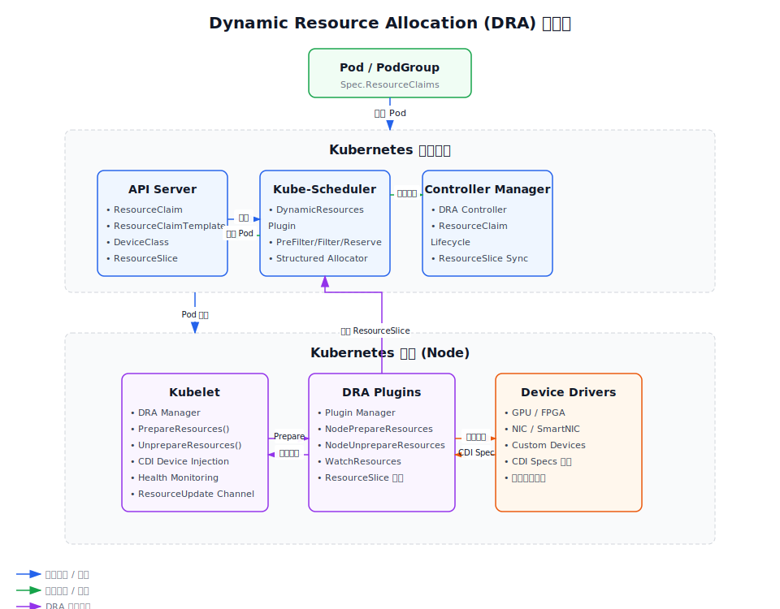

# 第5章 Dynamic Resource Allocation (DRA) 深度解析

## 5.1 什么是 Dynamic Resource Allocation

Dynamic Resource Allocation (DRA) 是 Kubernetes 在 1.20 版本中引入的全新资源调度框架，旨在解决传统 Extended Resources 和 Device Plugin 的局限性。DRA 提供了一个通用的、声明式的资源调度模型，允许第三方资源驱动以标准化的方式提供异构硬件资源（如 GPU、FPGA、NIC 等）。

### DRA 解决的核心问题

1. **资源的声明式管理**：与 Device Plugin 的命令式 API 不同，DRA 采用声明式 API 模式
2. **资源的细粒度分配**：支持资源的分区、共享、复用等复杂场景
3. **拓扑感知调度**：内置对 NUMA、PCIe 拓扑的支持
4. **可扩展性**：第三方驱动可以通过标准接口提供自定义资源类型

## 5.2 DRA 核心架构

DRA 的整体架构由三个主要层次组成：



### 核心资源对象

DRA 引入了几个新的核心资源对象：

| 资源对象 | 作用 |
|---------|-----|
| **DeviceClass** | 定义设备的抽象类别和选择器，相当于一个资源模板 |
| **ResourceClaimTemplate** | 定义 Pod 需要使用的 ResourceClaim 的模板 |
| **ResourceClaim** | 实际的资源分配请求，可以被 Pod 申请使用 |
| **ResourceSlice** | 描述节点上可用的资源，由驱动程序发布 |

### 组件职责

#### 1. 控制平面组件

| 组件 | 职责 | 源码位置 |
|-----|-----|---------|
| **DynamicResources 调度插件** | DRA 资源的调度、分配和预留 | `pkg/scheduler/framework/plugins/dynamicresources/` |
| **DRA Controller** | ResourceClaim 生命周期管理，资源分配和状态同步 | `pkg/controller/resourceclaim/` |
| **API Server** | 提供 DRA 相关资源对象的 API 服务 | `pkg/apis/resource/` |

#### 2. 节点组件

| 组件 | 职责 | 源码位置 |
|-----|-----|---------|
| **DRA Manager (kubelet)** | 节点侧的 ResourceClaim 管理，驱动通信 | `pkg/kubelet/cm/dra/` |
| **DRA Plugin Manager** | 管理 DRA 驱动插件的注册和通信 | `pkg/kubelet/cm/dra/plugin/` |
| **第三方 DRA 驱动** | 具体硬件资源的实现 | 第三方代码 |

## 5.3 调度器源码深度解析

### DynamicResources 插件的核心结构

让我们看一下 `dynamicresources.go` 中的核心数据结构：

```go
// DynamicResources is a plugin that ensures that ResourceClaims are allocated.
type DynamicResources struct {
	enabled        bool
	fts            feature.Features
	filterTimeout  time.Duration
	bindingTimeout time.Duration
	fh             fwk.Handle
	clientset      kubernetes.Interface
	celCache       *cel.Cache
	draManager     fwk.SharedDRAManager
}
```

源码位置：[`kubernetes-release-1.36/pkg/scheduler/framework/plugins/dynamicresources/dynamicresources.go`](../kubernetes-release-1.36/pkg/scheduler/framework/plugins/dynamicresources/dynamicresources.go)

### 调度周期各扩展点实现

#### 1. PreFilter 阶段

PreFilter 阶段的主要工作是验证并准备 Pod 的 ResourceClaims：

```go
// PreFilter invoked at the prefilter extension point to check if pod has all
// immediate claims bound. UnschedulableAndUnresolvable is returned if
// the pod cannot be scheduled at the moment on any node.
func (pl *DynamicResources) PreFilter(ctx context.Context, state fwk.CycleState, pod *v1.Pod, nodes []fwk.NodeInfo) (*fwk.PreFilterResult, *fwk.Status) {
	// ...
}
```

**核心逻辑**：
- 验证 Pod 的所有 ResourceClaim 是否存在
- 检查已分配的 ResourceClaim 是否可以被 Pod 使用
- 收集待分配的 ResourceClaim 并初始化 Structured Allocator
- 处理 PodGroup 协同调度（1.36 新特性）

#### 2. Filter 阶段

Filter 阶段确定节点是否适合运行该 Pod：

```go
// Filter invoked at the filter extension point.
// It evaluates if a pod can fit due to the resources it requests,
// for both allocated and unallocated claims.
//
// For claims that are bound, then it checks that the node affinity is
// satisfied by the given node.
//
// For claims that are unbound, it checks whether the claim might get allocated
// for the node.
func (pl *DynamicResources) Filter(ctx context.Context, cs fwk.CycleState, pod *v1.Pod, nodeInfo fwk.NodeInfo) *fwk.Status {
	// ...
}
```

**核心逻辑**：
- 对每个已分配的 ResourceClaim 验证节点亲和性
- 使用 Structured Allocator 检查未分配的 ResourceClaim 是否能在该节点上分配
- 检查 Device Binding Conditions（1.36 新特性）
- 验证 Node Allocatable Resources（1.36 新特性）

#### 3. Reserve 阶段

Reserve 阶段预留资源：

```go
// Reserve reserves claims for the pod.
func (pl *DynamicResources) Reserve(ctx context.Context, cs fwk.CycleState, pod *v1.Pod, nodeName string) (status *fwk.Status) {
	// ...
}
```

**核心逻辑**：
- 为未分配的 ResourceClaim 分配具体的设备
- 更新 ResourceClaim 的 AllocationResult
- 处理 PodGroup 中的共享 ResourceClaim

#### 4. PreBind 阶段

PreBind 阶段执行实际的绑定操作：

```go
// PreBind binds the claims.
func (pl *DynamicResources) PreBind(ctx context.Context, cs fwk.CycleState, pod *v1.Pod, nodeName string) (status *fwk.Status) {
	// ...
}
```

**核心逻辑**：
- 将 ResourceClaim 与 Pod 绑定
- 更新 ResourceClaim 的 ReservedFor 字段
- 处理 Node Allocatable Resource 的状态更新

### Structured Allocator 深度解析

Structured Allocator 是 DRA 1.24+ 版本引入的核心组件，负责处理结构化资源参数的分配：

```go
// Allocator handles claims with structured parameters.
type Allocator struct {
	// ...
}
```

**主要功能**：
- 解析 DeviceClass 中的选择器和过滤器
- 使用 CEL 表达式进行资源过滤和评分
- 计算设备的可用性和共享性
- 处理设备分区（Partitionable Devices）
- 支持批量分配（1.36 新特性）

## 5.4 Kubelet 源码深度解析

### DRA Manager 核心结构

让我们查看 kubelet 中 DRA Manager 的实现：

```go
// Manager is responsible for managing ResourceClaims.
// It ensures that they are prepared before starting pods
// and that they are unprepared before the last consuming
// pod is declared as terminated.
type Manager struct {
	// draPlugins manages the registered plugins.
	draPlugins *draplugin.DRAPluginManager

	// cache contains cached claim info
	cache *claimInfoCache

	// reconcilePeriod is the duration between calls to reconcileLoop.
	reconcilePeriod time.Duration

	// activePods is a method for listing active pods on the node
	// so all claim info state can be updated in the reconciliation loop.
	activePods ActivePodsFunc

	// sourcesReady provides the readiness of kubelet configuration sources such as apiserver update readiness.
	// We use it to determine when we can treat pods as inactive and react appropriately.
	sourcesReady config.SourcesReady

	// KubeClient reference
	kubeClient clientset.Interface

	// healthInfoCache contains cached health info
	healthInfoCache *healthInfoCache

	// update channel for resource updates
	update chan resourceupdates.Update
}
```

源码位置：[`kubernetes-release-1.36/pkg/kubelet/cm/dra/manager.go`](../kubernetes-release-1.36/pkg/kubelet/cm/dra/manager.go)

### PrepareResources 流程深度分析

这是 DRA 在节点侧最核心的流程，让我们详细分析：

```go
// PrepareResources attempts to prepare all of the required resources
// for the input container, issue NodePrepareResources rpc requests
// for each new resource requirement, process their responses and update the cached
// containerResources on success.
func (m *Manager) PrepareResources(ctx context.Context, pod *v1.Pod) error {
	// ...
}
```

**完整流程图**：

```
Pod 创建
   ↓
kubelet 调用 PrepareResources
   ↓
1. 验证阶段
   ├─ 获取 Pod 的 ResourceClaims
   ├─ 检查 ResourceClaim 所有权
   └─ 验证 Pod 是否在 ReservedFor 列表中
   ↓
2. 缓存更新阶段
   ├─ 创建或获取 ClaimInfo
   ├─ 添加 Pod 引用到 ClaimInfo
   └─ Checkpoint 缓存到磁盘
   ↓
3. 资源准备阶段 (如果未准备)
   ├─ 按 Driver 分组 ResourceClaims
   ├─ 调用每个 Driver 的 NodePrepareResources
   ├─ 解析响应中的 CDI 设备信息
   └─ 更新 ClaimInfo 的设备信息
   ↓
4. 完成阶段
   ├─ 标记 ClaimInfo 为已准备
   ├─ Checkpoint 更新后的状态
   └─ PrepareResources 完成
```

### PrepareResources 源码关键步骤

让我们查看源码的关键部分：

```go
func (m *Manager) prepareResources(ctx context.Context, pod *v1.Pod) error {
	// Step 1: 获取 Pod 的 ResourceClaims
	podResourceClaims := pod.Spec.ResourceClaims
	
	// Step 2: 处理 Extended Resources (1.36 新特性)
	if utilfeature.DefaultFeatureGate.Enabled(features.DRAExtendedResource) {
		if pod.Status.ExtendedResourceClaimStatus != nil {
			extendedResourceClaim := v1.PodResourceClaim{
				ResourceClaimName: &amp;pod.Status.ExtendedResourceClaimStatus.ResourceClaimName,
			}
			podResourceClaims = make([]v1.PodResourceClaim, 0, len(pod.Spec.ResourceClaims)+1)
			podResourceClaims = append(podResourceClaims, pod.Spec.ResourceClaims...)
			podResourceClaims = append(podResourceClaims, extendedResourceClaim)
		}
	}
	
	// Step 3: 验证所有 ResourceClaim
	for i := range podResourceClaims {
		podClaim := &amp;podResourceClaims[i]
		claimName, mustCheckOwner, err := resourceclaim.Name(pod, podClaim)
		if err != nil {
			return err
		}
		if claimName == nil {
			continue
		}
		
		// 从 APIServer 获取 ResourceClaim
		resourceClaim, err := m.kubeClient.ResourceV1().ResourceClaims(pod.Namespace).Get(
			ctx, *claimName, metav1.GetOptions{})
		if err != nil {
			return fmt.Errorf("fetch ResourceClaim %s: %w", *claimName, err)
		}
		
		// 验证所有权
		if mustCheckOwner {
			if err = resourceclaim.IsForPod(pod, resourceClaim, m.podGroupResourceClaimsEnabled()); err != nil {
				return err
			}
		}
		
		// 检查是否为 Pod 保留
		if !resourceclaim.IsReservedForPod(pod, resourceClaim, m.podGroupResourceClaimsEnabled()) {
			return fmt.Errorf("pod %s (%s) is not allowed to use ResourceClaim %s (%s)",
				pod.Name, pod.UID, *claimName, resourceClaim.UID)
		}
		
		// 创建 ClaimInfo
		claimInfo, err := newClaimInfoFromClaim(resourceClaim)
		if err != nil {
			return fmt.Errorf("ResourceClaim %s: %w", resourceClaim.Name, err)
		}
		
		// 获取对应的 DRA Driver Plugin
		for driverName := range claimInfo.DriverState {
			_, err := m.draPlugins.GetPlugin(driverName)
			if err != nil {
				return err
			}
		}
	}
	
	// Step 4: 更新缓存
	err := m.cache.withLock(logger, func() error {
		for i := range podResourceClaims {
			resourceClaim := infos[i].resourceClaim
			podClaim := infos[i].podClaim
			if resourceClaim == nil {
				continue
			}
			
			// 获取或创建 ClaimInfo
			claimInfo, exists := m.cache.get(resourceClaim.Name, resourceClaim.Namespace)
			if !exists {
				claimInfo = infos[i].claimInfo
				m.cache.add(claimInfo)
			} else {
				if claimInfo.ClaimUID != resourceClaim.UID {
					return fmt.Errorf("old ResourceClaim with same name %s and different UID %s still exists", resourceClaim.Name, claimInfo.ClaimUID)
				}
			}
			
			// 添加 Pod 引用
			claimInfo.addPodReference(pod.UID)
			
			// Checkpoint 缓存
			if err := m.cache.syncToCheckpoint(); err != nil {
				return fmt.Errorf("checkpoint ResourceClaim cache: %w", err)
			}
			
			// 如果已经准备，跳过
			if claimInfo.isPrepared() {
				continue
			}
		}
		return nil
	})
	if err != nil {
		return err
	}
	
	// Step 5: 调用 DRA Driver 准备资源
	for plugin, claims := range batches {
		// 调用 NodePrepareResources RPC
		response, err := plugin.NodePrepareResources(ctx, &amp;drapb.NodePrepareResourcesRequest{Claims: claims})
		if err != nil {
			return fmt.Errorf("NodePrepareResources: %w", err)
		}
		
		for claimUID, result := range response.Claims {
			reqClaim := lookupClaimRequest(claims, claimUID)
			if reqClaim == nil {
				return fmt.Errorf("NodePrepareResources returned result for unknown claim UID %s", claimUID)
			}
			if result.GetError() != "" {
				return fmt.Errorf("NodePrepareResources failed for ResourceClaim %s: %s", reqClaim.Name, result.Error)
			}
			
			claim := resourceClaims[types.UID(claimUID)]
			
			// 更新缓存中的设备信息
			err := m.cache.withLock(logger, func() error {
				info, exists := m.cache.get(claim.Name, claim.Namespace)
				if !exists {
					return fmt.Errorf("internal error: unable to get claim info for ResourceClaim %s in namespace %s", claim.Name, claim.Namespace)
				}
				for _, device := range result.GetDevices() {
					info.addDevice(plugin.DriverName(), state.Device{
						PoolName:     device.PoolName,
						DeviceName:   device.DeviceName,
						ShareID:      (*types.UID)(device.ShareId),
						RequestNames: device.RequestNames,
						CDIDeviceIDs: device.CdiDeviceIds,
					})
				}
				return nil
			})
			if err != nil {
				return err
			}
		}
	}
	
	// Step 6: 标记为已准备
	err = m.cache.withLock(logger, func() error {
		for _, claim := range resourceClaims {
			info, exists := m.cache.get(claim.Name, claim.Namespace)
			if !exists {
				return fmt.Errorf("internal error: unable to get claim info for ResourceClaim %s in namespace %s", claim.Name, claim.Namespace)
			}
			info.setPrepared()
		}
		
		if err := m.cache.syncToCheckpoint(); err != nil {
			return fmt.Errorf("checkpoint ResourceClaim state: %w", err)
		}
		
		return nil
	})
	if err != nil {
		return err
	}
	
	return nil
}
```

### GetResources 流程

在容器启动前，kubelet 调用 GetResources 来获取需要注入的 CDI 设备：

```go
// GetResources gets a ContainerInfo object from the claimInfo cache.
// This information is used by the caller to update a container config.
func (m *Manager) GetResources(pod *v1.Pod, container *v1.Container) (*ContainerInfo, error) {
	cdiDevices := []kubecontainer.CDIDevice{}
	
	// 收集容器需要的 ResourceClaims
	claimRequests := make(map[string][]string)
	
	// 处理普通 ResourceClaims
	containerClaimsMap := make(map[string][]string, len(container.Resources.Claims))
	for _, claim := range container.Resources.Claims {
		if _, ok := containerClaimsMap[claim.Name]; !ok {
			containerClaimsMap[claim.Name] = []string{}
		}
		containerClaimsMap[claim.Name] = append(containerClaimsMap[claim.Name], claim.Request)
	}
	
	for i := range pod.Spec.ResourceClaims {
		podClaim := &amp;pod.Spec.ResourceClaims[i]
		requests, ok := containerClaimsMap[podClaim.Name]
		if !ok {
			continue
		}
		
		claimName, _, err := resourceclaim.Name(pod, podClaim)
		if err != nil {
			return nil, err
		}
		if claimName == nil {
			continue
		}
		
		claimRequests[*claimName] = append(claimRequests[*claimName], requests...)
	}
	
	// 处理 Extended Resource Claim (1.36 新特性)
	if utilfeature.DefaultFeatureGate.Enabled(features.DRAExtendedResource) &amp;&amp; pod.Status.ExtendedResourceClaimStatus != nil {
		claimName := pod.Status.ExtendedResourceClaimStatus.ResourceClaimName
		extendedResourceRequests := make(map[string]bool)
		for rName, rValue := range container.Resources.Requests {
			if !rValue.IsZero() &amp;&amp; schedutil.IsDRAExtendedResourceName(rName) {
				extendedResourceRequests[rName.String()] = true
			}
		}
		
		for _, rm := range pod.Status.ExtendedResourceClaimStatus.RequestMappings {
			if rm.ContainerName == container.Name &amp;&amp; extendedResourceRequests[rm.ResourceName] {
				claimRequests[claimName] = append(claimRequests[claimName], rm.RequestName)
			}
		}
	}
	
	// 从缓存获取 CDI 设备
	for claimName, requestNames := range claimRequests {
		err := m.cache.withRLock(func() error {
			claimInfo, exists := m.cache.get(claimName, pod.Namespace)
			if !exists {
				return fmt.Errorf("internal error: unable to get claim info for ResourceClaim %s in namespace %s", claimName, pod.Namespace)
			}
			
			for _, requestName := range requestNames {
				cdiDevices = append(cdiDevices, claimInfo.cdiDevicesAsList(requestName)...)
			}
			return nil
		})
		if err != nil {
			return nil, err
		}
	}
	
	return &amp;ContainerInfo{CDIDevices: cdiDevices}, nil
}
```

### UnprepareResources 流程

当 Pod 终止时，需要清理资源：

```go
// UnprepareResources calls a driver's NodeUnprepareResource API for each resource claim owned by a pod.
// This function is idempotent and may be called multiple times against the same pod.
// As such, calls to the underlying NodeUnprepareResource API are skipped for claims that have
// already been successfully unprepared.
func (m *Manager) UnprepareResources(ctx context.Context, pod *v1.Pod) error {
	// ...
}
```

**核心逻辑**：
- 移除 Pod 对 ResourceClaim 的引用
- 如果没有 Pod 再使用该 ResourceClaim，则调用 NodeUnprepareResources
- 从缓存中删除 ClaimInfo
- Checkpoint 更新后的状态

### 健康监控 (1.36 新特性)

Kubernetes 1.36 引入了 DRA 设备健康监控：

```go
// HandleWatchResourcesStream processes health updates from the DRA plugin.
func (m *Manager) HandleWatchResourcesStream(ctx context.Context, stream drahealthv1alpha1.DRAResourceHealth_NodeWatchResourcesClient, pluginName string) error {
	// ...
}
```

这个功能允许 DRA 驱动实时推送设备健康状态更新，kubelet 会：
- 缓存健康状态
- 通过 `UpdateAllocatedResourcesStatus` 更新 Pod 状态
- 发送 `resourceupdates.Update` 事件，触发 Pod 重新调度（如果需要）

## 5.5 DRA 完整生命周期

### 1. 资源发布阶段

DRA 驱动启动后，需要发布节点上的可用资源：

```
DRA Driver 启动
   ↓
注册到 DRA Plugin Manager
   ↓
创建 ResourceSlice 对象
   ├─ 描述节点上的设备池
   ├─ 包含设备属性和拓扑信息
   └─ 可选：设备污点规则 (1.36 新特性)
   ↓
APIServer 存储 ResourceSlice
   ↓
调度器和控制器 Watch ResourceSlice 更新
```

### 2. Pod 创建与调度阶段

```
用户创建 Pod (包含 ResourceClaimTemplate)
   ↓
Pod 创建 ResourceClaim
   ↓
调度器开始调度
   ├─ PreFilter: 初始化 DRA 状态，创建 Allocator
   ├─ Filter: 检查节点是否能分配资源
   ├─ PostFilter: 处理资源释放 (如果需要)
   ├─ Reserve: 分配具体设备
   └─ PreBind: 更新 ResourceClaim 状态
   ↓
Pod 绑定到节点
```

### 3. Pod 运行阶段 (Kubelet 侧)

```
Pod 到达目标节点
   ↓
Kubelet 调用 PrepareResources
   ├─ 获取 ResourceClaim
   ├─ 验证 Pod 权限
   ├─ 按 Driver 分组
   ├─ 调用 Driver 的 NodePrepareResources
   ├─ 获取 CDI 设备信息
   └─ 缓存设备信息
   ↓
Kubelet 调用 GetResources 获取 CDI 配置
   ↓
容器运行时使用 CDI 注入设备
   ↓
Pod 运行
   ↓
(可选) Driver 通过 WatchResources 推送健康更新
   ├─ Kubelet 更新缓存
   └─ 触发 Pod 状态更新或重新调度
```

### 4. Pod 终止阶段

```
Pod 终止
   ↓
Kubelet 调用 UnprepareResources
   ├─ 从缓存移除 Pod 引用
   ├─ 如果没有其他 Pod 使用
   ├─ 调用 Driver 的 NodeUnprepareResources
   └─ 清理缓存
   ↓
(可选) ResourceClaim 被删除或重用
```

## 5.6 Kubernetes 1.36 新特性深度解析

### 1. Opportunistic Batch Scheduling (Alpha)

**功能描述**：允许批量处理多个 Pod 的 ResourceClaim 分配，提高调度吞吐。

**源码特点**：
- PodGroup 级别的资源预留
- 支持跨 Pod 共享 ResourceClaim
- 批量分配优化，减少调度周期次数

**关键代码**：
```go
// getPodGroupStateData 获取 PodGroup 状态
func getPodGroupStateData(cs fwk.CycleState) (*podGroupStateData, error) {
	// ...
}
```

### 2. DRA Extended Resource (Alpha)

**功能描述**：允许 DRA 驱动提供符合 Extended Resource 命名规范的资源，无需修改 Pod Spec。

**源码特点**：
- 自动创建和管理特殊的 ResourceClaim
- 透明的请求映射（Extended Resource → DRA Request）
- 向后兼容

**关键代码**：
```go
// 处理 ExtendedResourceClaimStatus
if utilfeature.DefaultFeatureGate.Enabled(features.DRAExtendedResource) {
	if pod.Status.ExtendedResourceClaimStatus != nil {
		claimName := pod.Status.ExtendedResourceClaimStatus.ResourceClaimName
		// ...
	}
}
```

### 3. Device Binding Conditions (Beta)

**功能描述**：ResourceClaim 可以有绑定条件，只有条件满足时才被认为是可用的。

**源码特点**：
- 在 Filter 阶段检查绑定条件
- 支持超时机制
- PostFilter 阶段可以处理超时的 ResourceClaim

### 4. Device Taint Rules (Alpha)

**功能描述**：ResourceSlice 可以定义设备污点规则，影响调度决策。

**源码特点**：
- 在 Structured Allocator 中实现
- 支持复杂的污点/容忍规则
- 影响节点评分

### 5. Node Allocatable Resources (Alpha)

**功能描述**：节点上可以预留一部分 DRA 资源给系统使用。

**源码特点**：
- 在 ResourceSlice 中定义 Allocatable
- 调度器在 Filter 阶段验证
- Kubelet 验证资源使用

## 5.7 实战配置示例

### 基础 DRA 资源使用

```yaml
# DeviceClass 定义
apiVersion: resource.k8s.io/v1alpha2
kind: DeviceClass
metadata:
  name: example-gpu
spec:
  selectors:
  - driver: example.com/gpu
    model: "A100"
    attributes:
      memory: "80Gi"

---
# Pod 定义
apiVersion: v1
kind: Pod
metadata:
  name: gpu-pod
spec:
  containers:
  - name: app
    image: myapp:latest
    resources:
      claims:
      - name: gpu
  resourceClaims:
  - name: gpu
    source:
      resourceClaimTemplateName: gpu-template

---
# ResourceClaimTemplate 定义
apiVersion: resource.k8s.io/v1alpha2
kind: ResourceClaimTemplate
metadata:
  name: gpu-template
spec:
  spec:
    devices:
      requests:
      - name: gpu
        deviceClassName: example-gpu
```

### 资源共享示例

```yaml
apiVersion: resource.k8s.io/v1alpha2
kind: ResourceClaimTemplate
metadata:
  name: shared-gpu-template
spec:
  spec:
    devices:
      requests:
      - name: gpu
        deviceClassName: example-gpu
        allocationMode: shared  # 共享模式
```

### 拓扑感知调度

```yaml
apiVersion: resource.k8s.io/v1alpha2
kind: ResourceClaimTemplate
metadata:
  name: topology-aware-gpu
spec:
  spec:
    devices:
      requests:
      - name: gpu
        deviceClassName: example-gpu
      constraints:
      - matchAttribute:
          driver: example.com/gpu
          attribute: "numa.node"
        requests: ["gpu"]
```

## 5.8 DRA 与 CSI 的潜在结合方向

虽然 Kubernetes 官方尚未正式规划 DRA 与存储 CSI 的深度结合，但从技术架构来看，这种结合在未来是有可能的：

1. **统一资源调度**：存储资源和计算资源采用类似的声明式模型
2. **拓扑协同**：存储和计算的拓扑亲和性调度
3. **性能感知**：结合存储性能指标的智能调度
4. **可观测性**：统一的资源健康监控体系

不过这需要社区进一步讨论和设计，目前还处于概念阶段。
