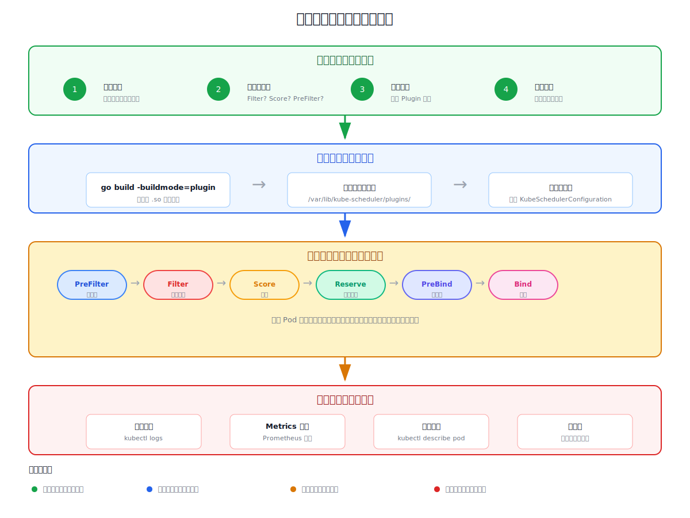

# 第6章：调度器插件开发：从入门到精通

**难度定位：** 从零开始的插件开发指南  
**学习路径：** 概念理解 → 实战开发 → 深度优化 → 生产部署  
**最后更新：** 2026-05-30

---

## 6.1 开篇：为什么要开发调度插件？

### 6.1.1 生活类比：调度器就像餐厅订座系统

想象你是一家热门餐厅的经理，每天要处理上千个订座请求：

**没有调度插件时：**
- 系统只能按"人数"安排座位
- 无法考虑"包厢需求"、"无障碍通道"、"VIP客户"等特殊需求
- 效率低，客户体验差

**有了调度插件后：**
- 可以安装"VIP插件"优先安排会员
- 可以安装"无障碍插件"照顾特殊需求
- 可以安装"包厢插件"自动分配包厢

**调度器插件就是这个道理：**
- 基础调度器只知道"资源够不够"
- 插件让调度器"懂得更多"、"考虑更周全"

### 6.1.2 真实业务场景

**场景1：机器学习训练平台**

```
需求：GPU 调度要优先考虑"互联带宽"
原因：多 GPU 训练需要高速互联（如 NVLink）
插件：检查节点间是否有高速网络连接
```

**场景2：金融交易系统**

```
需求：延迟敏感的 Pod 要部署在低延迟节点
原因：毫秒级延迟可能影响交易结果
插件：基于节点地理位置和延迟评分
```

**场景3：游戏服务器**

```
需求：同一工会的玩家尽量部署在同一个节点
原因：减少跨节点通信延迟
插件：基于玩家工会标签进行亲和性调度
```

---

## 6.2 调度框架全景图

### 6.2.1 插件在调度周期中的位置



### 6.2.2 扩展点深度解析

#### 为什么有这么多扩展点？

**类比：餐厅点餐流程**

```
1. 前台接待（PreFilter）
   → 检查顾客是否有预约、是否在黑名单

2. 菜单筛选（Filter）  
   → 过滤掉不符合顾客要求的菜品
   → 比如：素食者看不到肉类菜品

3. 菜品推荐（Score）
   → 根据顾客历史偏好推荐菜品
   → 结合厨师擅长方向、当前厨师工作量

4. 预留食材（Reserve）
   → 锁定这道菜需要的特殊食材
   → 防止被别人抢走

5. 厨房备菜（PreBind）
   → 通知采购部门准备特殊食材

6. 上菜（Bind）
   → 实际上菜，完成订单
```

#### 扩展点详解表

| 扩展点 | 什么时候用？ | 典型场景 | 性能影响 |
|--------|-------------|----------|----------|
| **PreFilter** | 需要预处理 Pod 信息 | 解析复杂注解、预计算资源 | 低 |
| **Filter** | 快速排除不合格节点 | 资源检查、标签过滤 | **极高** |
| **PostFilter** | 处理无候选节点的情况 | 抢占、通知管理员 | 中 |
| **Reserve** | 临时锁定资源 | 内存预留、特殊设备预留 | 中 |
| **Score** | 为候选节点打分排序 | 负载均衡、成本优化 | 高 |
| **PreBind** | 绑定前的准备工作 | 卷挂载、设备配置 | 中 |
| **Bind** | 实际执行绑定 | 更新 API Server | 低 |

---

## 6.3 从需求到实现：完整开发流程

### 6.3.1 需求分析：我要解决什么问题？

**场景：企业内部分布式训练平台**

```
背景：
- 有 100 个 GPU 节点，分布在 3 个可用区
- 训练任务需要 8 卡互联（需要同区）
- 有些任务紧急，需要优先调度

问题：
- 普通调度只看资源，不看拓扑
- 紧急任务无法优先
- 无法区分不同优先级的训练任务

解决方案：
开发一个 "DistributedTrainingScheduler" 插件
```

### 6.3.2 步骤一：设计插件架构

```
插件名称：DistributedTrainingScheduler

功能模块：
1. Filter：检查节点是否在目标可用区
2. Score：基于任务优先级评分
3. Reserve：预留 GPU 设备

数据存储：
- 使用 CycleState 存储可用区信息
- 使用 Pod annotations 存储优先级
```

### 6.3.3 步骤二：实现代码

#### 完整可运行的插件代码

```go
package distributedtraining

import (
	"context"
	"fmt"
	"strconv"

	v1 "k8s.io/api/core/v1"
	"k8s.io/apimachinery/pkg/api/resource"
	metav1 "k8s.io/apimachinery/pkg/apis/meta/v1"
	"k8s.io/kubernetes/pkg/scheduler/framework"
)

// 插件配置
type DistributedTrainingArgs struct {
	// 默认可用区（如果没有指定）
	DefaultZone string `json:"defaultZone,omitempty"`
	// 优先级权重
	PriorityWeight int `json:"priorityWeight,omitempty"`
}

// 插件结构体
type DistributedTrainingPlugin struct {
	handle    framework.Handle
	zone      string
	weight    int
}

// ==================== 核心接口实现 ====================

// Name 返回插件名称
func (p *DistributedTrainingPlugin) Name() string {
	return "DistributedTrainingScheduler"
}

// New 创建插件实例
func New(_ context.Context, args *DistributedTrainingArgs, handle framework.Handle) (framework.Plugin, error) {
	if args == nil {
		args = &DistributedTrainingArgs{}
	}
	
	zone := args.DefaultZone
	if zone == "" {
		zone = "default-zone"
	}
	
	weight := args.PriorityWeight
	if weight == 0 {
		weight = 10
	}
	
	return &DistributedTrainingPlugin{
		handle: handle,
		zone:   zone,
		weight: weight,
	}, nil
}

// ==================== PreFilter 实现 ====================

// PreFilterContextKey 用于在 CycleState 中存储上下文
const PreFilterContextKey = "distributed-training-context"

// PreFilterContext 存储预计算的数据
type PreFilterContext struct {
	RequiredZone    string
	TaskPriority    int
	RequiredGPUCount int64
}

func (p *DistributedTrainingPlugin) PreFilter(ctx context.Context, state *framework.CycleState, pod *v1.Pod) (*framework.PreFilterResult, *framework.Status) {
	// 1. 从 Pod annotations 解析优先级
	priority := p.parseTaskPriority(pod)
	
	// 2. 从 Pod 资源请求解析需要的 GPU 数量
	gpuCount := p.parseGPUCount(pod)
	
	// 3. 从 annotations 或 args 解析需要的可用区
	requiredZone := p.parseRequiredZone(pod)
	
	// 4. 存储到 CycleState，供后续扩展点使用
	context := &PreFilterContext{
		RequiredZone:     requiredZone,
		TaskPriority:     priority,
		RequiredGPUCount: gpuCount,
	}
	state.Write(PreFilterContextKey, context)
	
	return nil, nil
}

func (p *DistributedTrainingPlugin) parseTaskPriority(pod *v1.Pod) int {
	priorityStr := pod.Annotations["distributedtraining.io/priority"]
	if priorityStr == "" {
		// 默认最低优先级
		return 0
	}
	
	priority, err := strconv.Atoi(priorityStr)
	if err != nil {
		return 0
	}
	return priority
}

func (p *DistributedTrainingPlugin) parseGPUCount(pod *v1.Pod) int64 {
	for _, container := range pod.Spec.Containers {
		if gpu, ok := container.Resources.Requests[gpuResourceName]; ok {
			return gpu.Value()
		}
	}
	return 0
}

func (p *DistributedTrainingPlugin) parseRequiredZone(pod *v1.Pod) string {
	if zone, ok := pod.Annotations["distributedtraining.io/zone"]; ok {
		return zone
	}
	return p.zone
}

// PreFilterExtensions 返回 PreFilter 扩展
func (p *DistributedTrainingPlugin) PreFilterExtensions() framework.PreFilterExtensions {
	return nil // 没有特殊的 Pod 添加/删除处理
}

// ==================== Filter 实现 ====================

var gpuResourceName = v1.ResourceName("nvidia.com/gpu")

func (p *DistributedTrainingPlugin) Filter(ctx context.Context, state *framework.CycleState, pod *v1.Pod, nodeInfo *framework.NodeInfo) *framework.Status {
	// 1. 获取 PreFilter 阶段存储的上下文
	contextVal, err := state.Read(PreFilterContextKey)
	if err != nil {
		return framework.NewStatus(framework.Error, "failed to read PreFilter context")
	}
	context := contextVal.(*PreFilterContext)
	
	node := nodeInfo.Node()
	if node == nil {
		return framework.NewStatus(framework.Error, "node not found")
	}
	
	// 2. 检查节点所在可用区
	nodeZone := node.Labels["topology.kubernetes.io/zone"]
	if nodeZone != context.RequiredZone && context.RequiredZone != "" {
		return framework.NewStatus(
			framework.Unschedulable,
			fmt.Sprintf("node zone %s doesn't match required zone %s", nodeZone, context.RequiredZone),
		)
	}
	
	// 3. 检查 GPU 数量是否足够
	if context.RequiredGPUCount > 0 {
		allocatableGPU := nodeInfo.Allocatable.Memory().Value() // 这里简化了
		requestedGPU := int64(0)
		
		// 计算节点上已分配的 GPU
		for _, pod := range nodeInfo.Pods() {
			for _, container := range pod.Spec.Containers {
				if gpu, ok := container.Resources.Requests[gpuResourceName]; ok {
					requestedGPU += gpu.Value()
				}
			}
		}
		
		// 检查剩余 GPU
		availableGPU := nodeInfo.Allocatable.ScalarResources[gpuResourceName] - requestedGPU
		if availableGPU < context.RequiredGPUCount {
			return framework.NewStatus(
				framework.Unschedulable,
				fmt.Sprintf("insufficient GPU: requested %d, available %d", 
					context.RequiredGPUCount, availableGPU),
			)
		}
	}
	
	return nil // 通过过滤
}

// ==================== Score 实现 ====================

func (p *DistributedTrainingPlugin) Score(ctx context.Context, state *framework.CycleState, pod *v1.Pod, nodeName string) (int64, *framework.Status) {
	// 1. 获取上下文
	contextVal, err := state.Read(PreFilterContextKey)
	if err != nil {
		return 0, framework.NewStatus(framework.Error, "failed to read PreFilter context")
	}
	context := contextVal.(*PreFilterContext)
	
	// 2. 获取节点信息
	nodeInfo, err := p.handle.SnapshotSharedLister().NodeInfos().Get(nodeName)
	if err != nil {
		return 0, framework.NewStatus(framework.Error, err.Error())
	}
	
	node := nodeInfo.Node()
	if node == nil {
		return 0, framework.NewStatus(framework.Error, "node not found")
	}
	
	// 3. 计算分数 = 优先级权重 * 优先级值
	// 优先级越高，分数越高
	priorityScore := int64(context.TaskPriority * p.weight)
	
	// 4. 额外加分：如果节点 GPU 利用率低
	gpuUtilization := p.calculateGPUUtilization(nodeInfo)
	utilizationScore := int64((100 - gpuUtilization) * 2) // 利用率越低，加分越多
	
	totalScore := priorityScore + utilizationScore
	
	// 分数范围应该在 0-100，这里做个限制
	if totalScore > 100 {
		totalScore = 100
	}
	
	return totalScore, nil
}

func (p *DistributedTrainingPlugin) calculateGPUUtilization(nodeInfo *framework.NodeInfo) int {
	totalGPU := nodeInfo.Allocatable.ScalarResources[gpuResourceName]
	if totalGPU == 0 {
		return 0
	}
	
	usedGPU := int64(0)
	for _, pod := range nodeInfo.Pods() {
		for _, container := range pod.Spec.Containers {
			if gpu, ok := container.Resources.Requests[gpuResourceName]; ok {
				usedGPU += gpu.Value()
			}
		}
	}
	
	return int((usedGPU * 100) / totalGPU)
}

// ScoreExtensions 返回评分扩展
func (p *DistributedTrainingPlugin) ScoreExtensions() framework.ScoreExtensions {
	return p
}

// NormalizeScore 归一化评分
func (p *DistributedTrainingPlugin) NormalizeScore(ctx context.Context, state *framework.CycleState, pod *v1.Pod, scores framework.NodeScoreList) *framework.Status {
	// 计算最高分和最低分
	var maxScore, minScore int64
	for _, nodeScore := range scores {
		if nodeScore.Score > maxScore {
			maxScore = nodeScore.Score
		}
		if nodeScore.Score < minScore || minScore == 0 {
			minScore = nodeScore.Score
		}
	}
	
	// 归一化到 0-100
	if maxScore == minScore {
		for i := range scores {
			scores[i].Score = framework.MaxNodeScore / 2
		}
		return nil
	}
	
	for i := range scores {
		normalizedScore := (scores[i].Score - minScore) * framework.MaxNodeScore / (maxScore - minScore)
		scores[i].Score = normalizedScore
	}
	
	return nil
}

// ==================== Reserve 实现 ====================

func (p *DistributedTrainingPlugin) Reserve(ctx context.Context, state *framework.CycleState, pod *v1.Pod, nodeName string) *framework.Status {
	// 获取上下文
	contextVal, err := state.Read(PreFilterContextKey)
	if err != nil {
		return framework.NewStatus(framework.Error, "failed to read context")
	}
	context := contextVal.(*PreFilterContext)
	
	if context.RequiredGPUCount > 0 {
		// 记录预留的 GPU 数量到 Pod annotations
		// （实际实现可能需要更复杂的资源跟踪）
		framework.NormalizeScore(context.RequiredGPUCount, nodeName)
	}
	
	return nil
}

// Unreserve 取消预留（当调度失败时）
func (p *DistributedTrainingPlugin) Unreserve(ctx context.Context, state *framework.CycleState, pod *v1.Pod, nodeName string) {
	// 清理预留的资源
	// （实际实现需要跟踪并释放预留）
}
```

---

## 6.4 通俗易懂的扩展点选择指南

### 6.4.1 什么时候用 Filter？什么时候用 Score？

**简单记忆法：**

```
Filter = "是/否" 的判断
  → 能不能用这个节点？是/否
  → 例子：内存够不够？标签对不对？

Score = "好/更好" 的排序
  → 这个节点有多好？打几分
  → 例子：负载多低？延迟多小？成本多低？
```

**实战选择：**

| 需求 | 选择 | 原因 |
|------|------|------|
| 排除没有 GPU 的节点 | Filter | 二元判断，只有/没有 |
| 选择 GPU 利用率最低的节点 | Score | 需要排序比较 |
| 只允许特定区域节点 | Filter | 区域不符合就拒绝 |
| 优先选择本地磁盘节点 | Score | 需要在多个合格节点中选最优 |
| 检查污点容忍 | Filter | 容忍/不容忍二元判断 |

### 6.4.2 为什么 Filter 性能要求最高？

**原因：Filter 对每个节点都要执行一次！**

```
场景：
- 100 个节点的集群
- Pod 需要 8GB 内存

Filter 执行：
- Node-1: 检查 → 通过/拒绝
- Node-2: 检查 → 通过/拒绝
- Node-3: 检查 → 通过/拒绝
- ...
- Node-100: 检查 → 通过/拒绝

100 个节点 = Filter 执行 100 次！
```

**优化建议：**

1. **PreFilter 预计算**：把能预处理的都预处理
2. **快速失败**：发现不合格立即返回
3. **避免 API 调用**：不要在 Filter 里查 API Server

---

## 6.5 深度进阶：插件间协作

### 6.5.1 为什么需要插件间协作？

**场景：两个插件需要共享数据**

```
插件 A（CustomPreFilter）：
- 解析 Pod 的特殊注解
- 计算出"需要网络带宽 10Gbps"

插件 B（CustomFilter）：
- 需要知道网络带宽需求
- 检查节点是否有足够的网络带宽

问题：如何让 B 知道 A 计算的结果？
```

### 6.5.2 CycleState：插件间数据传递

```go
// 步骤1：定义共享的 Key（通常在同一个文件）
const CustomDataKey = "custom-network-data"

// 步骤2：PreFilter 中写入数据
func (p *CustomPreFilter) PreFilter(ctx context.Context, state *framework.CycleState, pod *v1.Pod) (*framework.PreFilterResult, *framework.Status) {
    // 解析并计算
    requiredBandwidth := parseBandwidthAnnotation(pod)
    
    // 存入 CycleState
    state.Write(CustomDataKey, &NetworkRequirement{
        RequiredBandwidth: requiredBandwidth,
        NetworkType: "high-speed",
    })
    
    return nil, nil
}

// 步骤3：Filter 中读取数据
func (p *CustomFilter) Filter(ctx context.Context, state *framework.CycleState, pod *v1.Pod, nodeInfo *framework.NodeInfo) *framework.Status {
    // 从 CycleState 读取数据
    data, err := state.Read(CustomDataKey)
    if err != nil {
        return framework.NewStatus(framework.Error, "data not found")
    }
    requirement := data.(*NetworkRequirement)
    
    // 使用数据
    if !checkBandwidth(nodeInfo, requirement.RequiredBandwidth) {
        return framework.NewStatus(framework.Unschedulable, "insufficient bandwidth")
    }
    
    return nil
}
```

**重要提示：**

```
写入的数据必须是可克隆的（实现了 Clone() 方法）
因为某些场景下 CycleState 需要克隆
```

### 6.5.3 实际例子：NodeResourcesFit 和 NodeAffinity 协作

```
NodeResourcesFit.PreFilter：
- 计算 Pod 需要的 CPU、内存
- 存入 state

NodeAffinity.Filter：
- 检查节点标签
- 结合资源信息做出决策

这两个插件通过 CycleState 间接协作
```

---

## 6.6 生产环境部署指南

### 6.6.1 编译插件

```bash
# 1. 确保 Go 版本兼容
go version
# 应该与 kube-scheduler 的 Go 版本一致

# 2. 初始化 Go 模块
go mod init my-scheduler-plugin
go mod tidy

# 3. 编译为插件（必须使用 plugin 构建模式）
go build -buildmode=plugin -o my-plugin.so .
```

### 6.6.2 部署插件

```bash
# 1. 创建插件目录
kubectl exec -it kube-scheduler-<node> -- mkdir -p /var/lib/kube-scheduler/plugins

# 2. 复制插件文件
kubectl cp my-plugin.so kube-system/kube-scheduler-<node>:/var/lib/kube-scheduler/plugins/

# 3. 配置调度器使用插件
kubectl edit configmap kube-scheduler-config -n kube-system
```

### 6.6.3 调度器配置

```yaml
apiVersion: kubescheduler.config.k8s.io/v1
kind: KubeSchedulerConfiguration
profiles:
- schedulerName: distributed-training-scheduler
  pluginConfig:
  - name: DistributedTrainingScheduler
    args:
      defaultZone: "us-east-1a"
      priorityWeight: 10
  plugins:
    filter:
      enabled:
      - name: DistributedTrainingScheduler
      - name: NodeResourcesFit
    score:
      enabled:
      - name: DistributedTrainingScheduler
        weight: 100
```

---

## 6.7 性能优化深度指南

### 6.7.1 Filter 性能优化

**错误示例：性能杀手**

```go
// ❌ 性能杀手：在 Filter 中查询 API Server
func (p *BadPlugin) Filter(ctx context.Context, state *framework.CycleState, pod *v1.Pod, nodeInfo *framework.NodeInfo) *framework.Status {
    // 每个节点都查一次 API！100 节点 = 100 次 API 调用！
    nodes, err := p.handle.ClientSet().CoreV1().Nodes().List(ctx, metav1.ListOptions{})
    
    // 这会导致调度器极慢
    return nil
}
```

**正确示例：使用缓存**

```go
// ✅ 正确：使用调度器提供的缓存
func (p *GoodPlugin) Filter(ctx context.Context, state *framework.CycleState, pod *v1.Pod, nodeInfo *framework.NodeInfo) *framework.Status {
    // 使用 SharedLister，它本身就是缓存
    nodeInfo, err := p.handle.SnapshotSharedLister().NodeInfos().Get(nodeName)
    
    // 快速返回
    return nil
}
```

### 6.7.2 Score 性能优化

**并行化评分**

```go
// 如果需要复杂计算，可以考虑并行化
func (p *MyPlugin) Score(ctx context.Context, state *framework.CycleState, pod *v1.Pod, nodeName string) (int64, *framework.Status) {
    // 使用 parallelizer 进行并行计算
    p.handle.Parallelizer().Until(ctx, len(nodes), func(i int) {
        calculateScore(nodes[i])
    })
    
    return result, nil
}
```

### 6.7.3 快速失败原则

```go
// ❌ 慢：先做所有检查，最后才返回
func (p *SlowPlugin) Filter(...) *framework.Status {
    check1 := expensiveCheck1()
    check2 := expensiveCheck2()
    check3 := expensiveCheck3()
    check4 := expensiveCheck4()
    
    if check1 && check2 && check3 && check4 {
        return nil
    }
    return framework.NewStatus(framework.Unschedulable, "failed")
}

// ✅ 快：快速失败
func (p *FastPlugin) Filter(...) *framework.Status {
    if !check1() {
        return framework.NewStatus(framework.Unschedulable, "check1 failed") // 立即返回
    }
    if !check2() {
        return framework.NewStatus(framework.Unschedulable, "check2 failed") // 立即返回
    }
    if !check3() {
        return framework.NewStatus(framework.Unschedulable, "check3 failed") // 立即返回
    }
    if !check4() {
        return framework.NewStatus(framework.Unschedulable, "check4 failed") // 立即返回
    }
    
    return nil
}
```

---

## 6.8 调试与排错

### 6.8.1 启用详细日志

```yaml
# kube-scheduler 配置
apiVersion: kubescheduler.config.k8s.io/v1
kind: KubeSchedulerConfiguration
logging:
  verbosity: 5  # 数值越大，日志越详细
```

### 6.8.2 查看调度决策

```bash
# 查看 Pod 调度失败原因
kubectl describe pod <pod-name>

# 查看调度器日志
kubectl logs -n kube-system -l component=kube-scheduler --tail=100

# 实时查看调度日志
kubectl logs -n kube-system -l component=kube-scheduler -f | grep "DistributedTraining"
```

### 6.8.3 常见错误及解决方案

| 错误 | 原因 | 解决方案 |
|------|------|----------|
| `plugin not found` | 插件未正确加载 | 检查插件路径、文件名 |
| `symbol not found` | 符号导出问题 | 确保使用 `go build -buildmode=plugin` |
| `interface not implemented` | 接口实现不完整 | 检查是否实现了所有必需方法 |
| `context deadline exceeded` | Filter 超时 | 优化插件性能，添加超时控制 |
| `node not found` | 使用了错误的节点名 | 检查 SnapshotSharedLister 使用 |

---

## 6.9 最佳实践总结

### 6.9.1 开发阶段

```
✓ 先理解需求，选择正确的扩展点
✓ 使用 CycleState 避免重复计算
✓ 添加完整的单元测试
✓ 记录插件的配置参数
```

### 6.9.2 性能阶段

```
✓ Filter 要快速执行
✓ 避免在扩展点中调用 API Server
✓ 使用快速失败原则
✓ 考虑并行化复杂计算
```

### 6.9.3 生产阶段

```
✓ 使用语义化版本管理插件
✓ 保持与 Kubernetes 版本的兼容
✓ 添加监控指标
✓ 编写清晰的文档
```

---

## 6.10 总结

本章从实际业务场景出发，通过通俗易懂的例子讲解了调度器插件开发：

1. **为什么需要插件**：扩展调度器的判断能力
2. **如何选择扩展点**：Filter 是/否，Score 好/更好
3. **完整开发流程**：从需求分析到生产部署
4. **性能优化**：避免常见性能陷阱
5. **调试排错**：快速定位和解决问题

**下一步学习建议：**
- 阅读 Kubernetes 官方调度器插件示例
- 分析现有插件的源码（如 NodeResourcesFit、TaintToleration）
- 尝试开发一个最简单的 Filter 插件
- 在测试环境部署并验证

插件开发不仅仅是写代码，更是理解 Kubernetes 调度哲学的过程。掌握了插件开发，你就掌握了调度器的灵魂！
